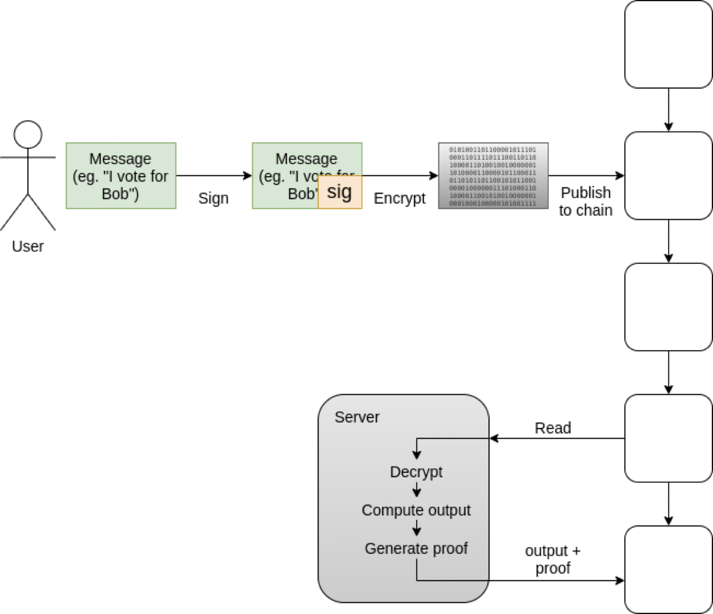
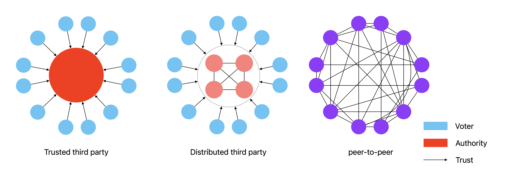
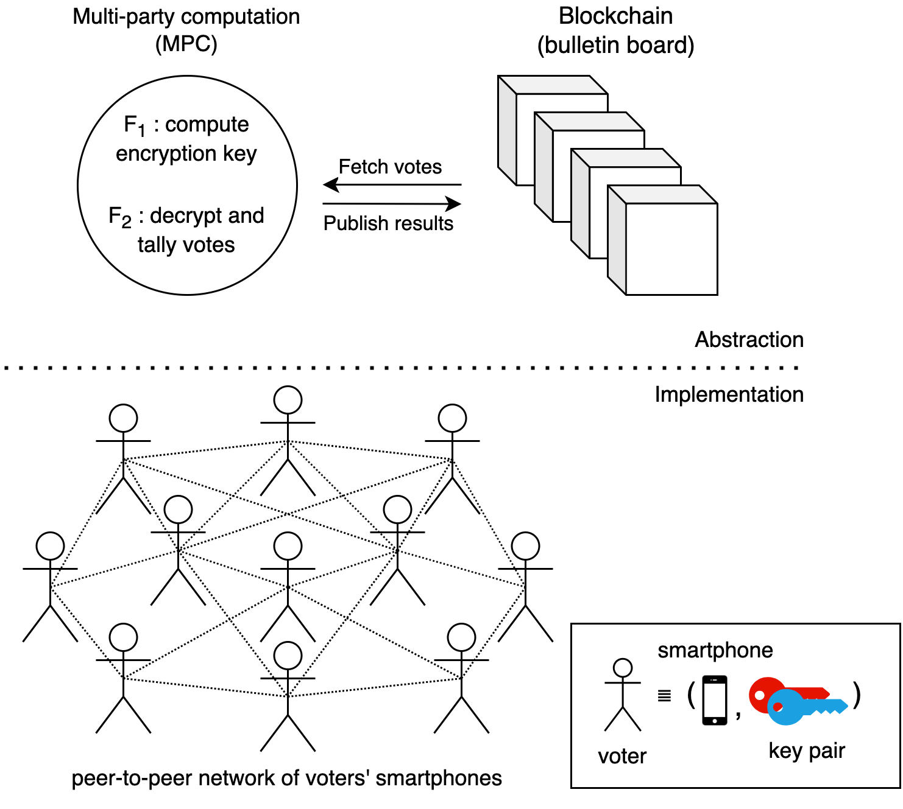
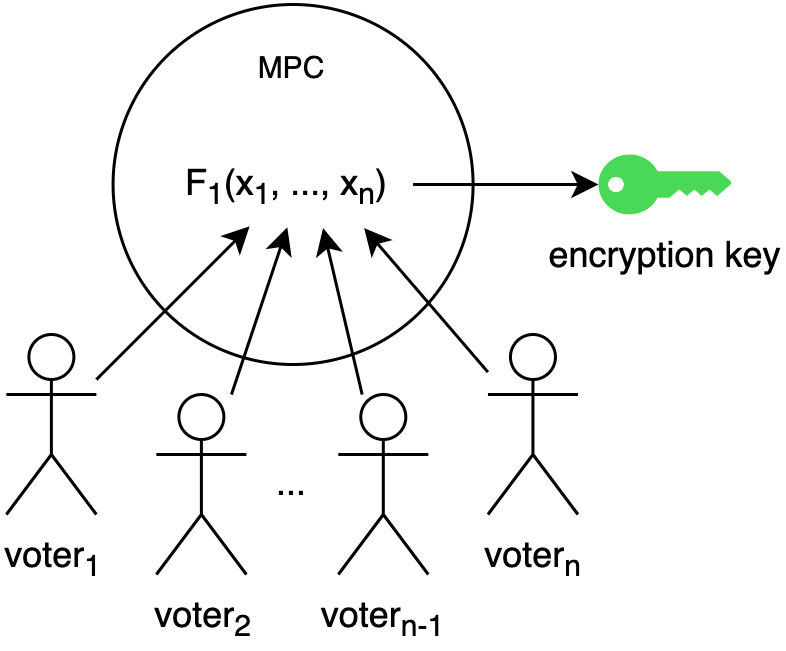
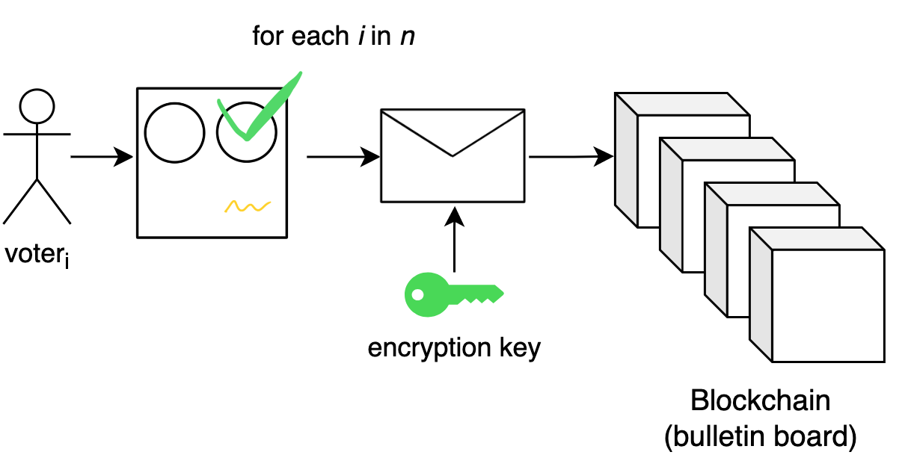

# Problem statement

Voting is one of the most popular mechanisms for collective decision-making; yet, it’s still something we can not do securely online.

There are several ways of voting; But, internet voting is the most conventional, cheapest, fastest, and safest (e.g., during the outbreak of COVID-19), and hence, a preferred method for conducting voting.

Internet voting can increase turnout and the frequency of votings, but most importantly, it can catalyze the further development of modern democracy. Enabling practical applications of direct democracy, liquid democracy, and all other sorts of voting methods like Quadratic Voting, Approval voting, Alternative vote, Score voting, and many others [@laslierLoserPluralityVoting2011].

Visions of smart cities, crypto cities [@buterinCryptoCities2021], Decentralised Autonomous Organisations [@wangDecentralizedAutonomousOrganizations2019], and other forms of algorithmic governance [@GovernmentAlgorithm2022] rely on the existence of internet voting, so there is a high demand for such systems.

Online voting is often compared to online banking. Admittedly, online voting requires much higher security than online banking. Many researchers and experts in the field doubt the possibility of conducting public voting over the internet [@parkGoingBadWorse2021; @mearianWhyBlockchainbasedVoting2019; @shanklandNoBlockchainIsn2018; @leeBlockchainbasedElectionsWould2018; @schneierBlockchainVoting2020; @schneierBlockchainTrust2019]. The resistance lies—among others—in insufficient confidence in the technology and a need for trust in the authorities controlling the voting process.

Most of the internet protocols rely on a trusted third party. They differ in what the server can or cannot do. The honesty of the trusted third party determines either anonymity, privacy, or coercion resistance properties.

Some of them use blockchain for integral and transparent storage (Voatz, Polys, MACI).

As described in [@buterinBlockchainVotingOverrated2021], the architecture usually looks as follows (Figure @fig:bc-ttp):

- Users participate by signing a message with their private key, encrypting the signed message to a public key published by a central server, and publishing the encrypted signed message to the blockchain. 
- The server downloads the messages from the blockchain, decrypts them, processes them, and outputs the result along with a ZK-SNARK to ensure that they did the computation correctly.

{#fig:bc-ttp}

Some solutions are distributing the trusted third party using MPC (Civitas, Swisspost/Scytl, iVoting).

We want to go even further and conduct the voting on voters’ end devices (PC, laptops, or even smartphones) using both blockchain and MPC (see Figure @fig:trust-models).

{#fig:trust-models}

Most people think about voting in terms of presidential elections. However, voting is used also in small, local votings like housing associations, board members, contests, and all forms of committees.

We don’t want to build:

- A large-scale voting system for presidential elections;
- A voting system for crypto space only;
- A perfectly secure, coercion-resistant, protocol.

Rather, we do want to build:

- A voting protocol for small to medium size voting like 100 voters;
- A voting protocol for people, without the crypto background;
- A decentralised and secure enough protocol that works.

“Blockchain voting is overrated among uninformed people but underrated among informed people,” says Vitalik Buterin, the co-founder of Ethereum, suggesting more optimism in academia about internet voting [@buterinBlockchainVotingOverrated2021].

# Goal

The project aims to solve the problem of internet voting by employing blockchain [@baranskiPracticalIVotingStellar2020], MPC [@evansPragmaticIntroductionSecure2018], zkSNARK [@ozdemirExperimentingCollaborativezkSNARKs2022], and an ad-hoc peer-to-peer network consisting of voters’ smartphones and laptops. Resulting in an internet voting protocol that achieves security, integrity, and privacy, without any trusted third party.

# Value proposition

1. Convenience, and safety. No need to leave your home to participate in voting.
2. Cheap. No need to print ballot papers or hire people to coordinate the voting process.
3. Trustless, secure, transparent. Users don't need to trust the authorities that their votes have been included and that the counting process has been correct.
4. Increased turnouts and the frequency of votings.
5. Enabling direct democracy, liquid democracy, and all other sorts of voting methods like Approval voting, Alternative vote, Score voting, and many others [@laslierLoserPluralityVoting2011]

# Technical vision

We will implement the proposed protocol by incrementally enhancing the current one [@baranskiPracticalIVotingStellar2020]:

1. First, we will develop an MPC protocol to compute the encryption key. This is achieved using Shamir Secret Sharing (SSS) or Distributed Key Generation (DKG) schemes [@gennaroSecureDistributedKey2007; @boldyrevaThresholdSignaturesMultisignatures2003]. The MPC-generated encryption key will replace the current server-generated encryption key.
2. Then, we will replace the current storage mechanism based on Stellar transactions, with the new Stellar's Soroban smart contract platform [^soroban].
3. Then, we will implement the MPC protocol for decryption and tally the votes stored in Soroban smart contract. This will remove the need for trusted-third-party used in the current protocol [@baranskiPracticalIVotingStellar2020]. 
4. Then, we will develop the zkSNARK protocol for generating proof of correctness of both MPC functionalities. The generated proof of correctness will be published to smart contracts along with the calculated results. 

# Technical overview

Voters form a peer-to-peer network using their smartphones. 
Let's assume a voter consists of a smartphone and a key pair (see Figure @fig:notation). 

{width=200px #fig:notation}

The first step that the network of voters' smartphones has to do is to form a peer-to-peer (or rather, smartphone-to-smartphone) network [@zhuangManagingAdHoc2013; @aloiSpontaneousSmartphoneNetworks2014].

A distributed network consisting of eligible voters runs a blockchain and MPC software. Consequently, two functionally separate networks (blockchain and MPC) are running on voters' devices. Blockchain network act as bulletin boards, where all transactions are collected and accessible to anyone. MPC network offers two functionalities: 1) jointly generating encryption key; 2) jointly decrypting and tallying votes, along with producing a zk-SNARK proof. The networks are communicating with each other for fetching votes and published results. A big-picture idea of the proposed system is presented in Figure @fig:architecture.

{#fig:architecture}

The voting process consists of three phases (rounds): 

0. bootstrapping p2p network phase presented in section @sec:bootstraping-p2p-network;
1. distributed encryption key generation phase presented in section @sec:setup-phase and figure @fig:setup; 
2. casting votes phase presented in section @sec:voting-phase and figure @fig:voting; 
3. tally phase presented in section @sec:tally-phase and figure @fig:tally.

### Bootstraping p2p network

The first step that the network of voters' smartphones has to do is to form a peer-to-peer (or rather, smartphone-to-smartphone) network [@zhuangManagingAdHoc2013; @aloiSpontaneousSmartphoneNetworks2014]. The network should be closed-membership, meaning that only eligible participants are allowed to join. This is achieved by publishing a predefined list of public keys $R=\{pk_1,...,pk_n\}$ corresponding to the eligible voters, who holds secret keys $sk$, such that, $pk \equiv g * sk$ for some known generator $g$.

Depending on the scale and type of voting, such a list can be created by organizers, or locally by the voters themselves. In order to prevent selling keypairs to briber, the keypairs should be associated with some stake: proof of citizenship of a country, high reputation in a local community, proof of humanity, or some amount of cryptocurrency, in such a way that the value of a stake is worth more than a vote from such address.

To establish a peer-to-peer (p2p) network over the internet it is required to solve many network-related problems. Namely, 

- Most of smartphones connected to the Internet are behind the NAT or some kind of firewall. Such devices work in asymmetric access policy, in which they can establish connections to other devices, but others can not establish connections to them. In settings where all devices work in asymmetric access policly it is impossible to start any connection [@fordPeertoPeerCommunicationNetwork2005]. To solve the issue we can use techniques like Traversal Using Relays around NAT (TURN), Circuit Relays, Rendezvous servers [@reddyTraversalUsingRelays2020; @libp2pCircuitRelay], Hole Punching, Session Traversal Utilities for NAT (STUN) [@petit-hugueninSessionTraversalUtilities2020], Interactive Connectivity Establishment (ICE)[@keranenInteractiveConnectivityEstablishment2018], and WebRTC [@ubertiWebRTCIPAddress].
- In a p2p network the number of connections between peers grows quadratically, i.e., $n^2$, where $n$ is the number of peers in the network. Moreover, there may be multiple connections between peers for each used protocol. To reduce the number of connections, we can use multiplexing like QUIC, Yamux, or Mplex [@libp2pStreamMultiplexing]), which allows re-using established connections for several protocols.
- The connections must be authenticated and encrypted. To solve the issue, we can use techniques like TLS [@rescorlaTransportLayerSecurity2018] or Noise [@perrinNoiseProtocolFramework2018].
- Peers must be able to discover each other. To do this, depending on network conditions, we can use Bootstrap peer list, Multicast DNS (mDNS), or Rendezvous servers.

To solve those issues we piggyback on the libp2p [@Libp2p], an open source library, which addresses all of the mentioned issues.

### Setup phase

Once the network is established nodes execute the first MPC functionality $F_1$, which lets nodes jointly compute $\textrm{PK} \equiv \textrm{SK} * g$, without reconstructing $\textrm{SK}$ on any single device. This is achieved using Shamir Secret Sharing (SSS) or Distributed Key Generation (DKG) schemes [@gennaroSecureDistributedKey2007; @boldyrevaThresholdSignaturesMultisignatures2003].

Symbolically, the functionality $F_1$ is defined as follows: $$F_1(\mathrm{SK}_1, ..., \mathrm{SK}_N) = DerivePubKey(DKG(\mathrm{SK}_1, ..., \mathrm{SK}_N)) \rightarrow PK$$
The reconstruction of a $\textrm{SK}$ is possible only if a sufficient number of votes (predefined threshold) collude. It would require executing malicious functionality $F_m(\mathrm{SK}_1, ..., \mathrm{SK}_N)=DerivePrivKey(\mathrm{SK}_1, ..., \mathrm{SK}_N) \rightarrow \textrm{SK}$. The situation should not happen under the honest majority assumption. 

{#fig:setup}

Read more [[Round 1. Setup]]

### Voting phase

We use [[Homomorphic Encryption ElGamal vs Paillier|ElGamal homomorphic encryption]] + [[Lookup Table]] of trapdoors to decrypt the results. It's the same encryption scheme used in [[Comparision to Polys|Polys]]. 

The voting process is illustrated in Figure @fig:voting.

{width=500px #fig:voting}

Let's first consider simple one candidate protocol.

#### One candidate, two options: yes/no

- Selection yes or no is denoted by $x = 1\ \mathrm{or}\ 0$
- Then, the single candidate vote is of a form: $A_{i} = a_{i} G + x_i H$, where
	- $i$ is a voter index;
	- $a_i$ is a blinding factor of voter $i$;
	- $G$ and $H$ are public parameters.
 - [[PoB - Proof of Ballot]]

#### Multiple candidates vote transaction
- Selection yes or no for candidate $c \in 1 \dots C$ is denoted by $x_{c} = 1\ \mathrm{or}\ 0$, where $C$ is total number of candidates;
- For simplicity assume $C=2$
- Then, the 2-candidate vote is of a form $A_{i}= a_{i}G + x_{1}H_{1} + x_{2}H_{2}$, where
	- $i$ is a voter index;
	- $a_i$ is a blinding factor of voter $i$;
	- $G$, $H_1$, $H_2$ are public parameters.
- The sum of all votes would be of a form $A = \sum_{1 \dots n} A_i$ which is $\sum_{1 \dots n} a_{i}G + X_{1}H_{1} + X_{2}H_2$, where: 
	- $X_1$ is the total sum for 1st candidate;
	- $X_2$ is the total sum for 2nd candidate.
 - [[PoB - Proof of Ballot]]

Read more [[Round 2. Voting]]

### Tally phase

Once the election period has finished, voters agree on a common state of the recorded transactions on the blockchain.

Then, using the second functionality $F_2$, voters jointly perform decentralized decryption and tallying of the ballots without reconstructing the decryption key on a single device.

Internally, $F_2$ validates all the recorded transactions and modifies their internal state accordingly to the content and the type of the transaction. Process each transaction as follows:

#### One candidate tally
Let's start with simple one candidate tally

Recall, single encrypted vote consist of two parts, the encrypted message, and shared secret. Represented as a tuple $(a_{i}G + x_{i}H; K_i)$, where:
1. $a_i$ is a blinding factor;
2. $x_i$ is either 1 or 0 for option yes or no..
3. $K_i$ is a public part of the DHKE.

The tally procedure goes as follows:
1. Accumulate all encrypted messages (first part of the tuple): $S = \sum_{i \dots n} a_{i}G + x_{i}H$;
2. Accumulate all public parts (second part of the tuple): $\mathrm{accKeys} = \sum_{i \dots n} K_i$.

> [!INFO]
To decrypt the results we need to calculate the $\mathrm{batchDecryptor} = p \cdot \mathrm{accKeys}$. Since it requires multiplying by decryption key $p$, which we don't want to reconstruct at any single device, we compute it inside MPC. It's the only computation that needs to be done inside MPC.

3. $[\mathrm{batchDecryptor}] = [p] \cdot \mathrm{accKeys}$;
4. $\mathrm{batchDecryptor} = \mathrm{open}([\mathrm{batchDecryptor}])$
5. $\mathrm{result} * G = S - \mathrm{batchDecryptor}$.
6. create [[PoD - Proof of Decryption]] $\pi$.
7. To extract the $\mathrm{result}$ (calculate "discrete logarithm") efficiently we search over precomputed lookup table. Since the result is guaranteed to be small, between $0 \leq result \leq n$.
8. As a result we publish (set of transactions, $batchDecryptor$, $result$, $\pi$)

Finally, the key shares $S_i$ should be destroyed from all voters' devices. As long as the majority of the nodes follow the procedure, the decryption key can not be reconstructed, that is, the malicious functionality $F_m$ can not be performed.

The results and certificate are published on the Blockchain (bulletin board). See Figure @fig:tally. 

{#fig:tally}

Read more [[Round 3. Tally]]

### Verification

After the results and the corresponding certificate has been published on the blockchain. Anyone—not only the voters taking part in the voting—can verify the correctness of the results using zk-SNARK verifier.

# Open questions

- How to design a protocol resilient to nodes' unavailability?
- How much RAM and disk space does the proposed protocol use?
- How long does it take to execute both functionalities on a mid-range smartphone?
- How to prevent DDoS attacks?
- How many votes per second can handle the proposed protocol?
- Which MPC framework to use?
- Which circuit compiler to use (e.g. [libsnark](https://github.com/scipr-lab/libsnark), [bellman](https://github.com/zkcrypto/bellman), [ZoKrates](https://github.com/JacobEberhardt/ZoKrates), [Snarky](https://github.com/o1-labs/snarky), [Circom](https://github.com/iden3/circom), or [others](https://zkp.science/))
- Which proving system to use ([libsnark](https://github.com/scipr-lab/libsnark), [bellman](https://github.com/zkcrypto/bellman), [dalek bulletproofs](https://github.com/dalek-cryptography/bulletproofs), [snarkjs](https://github.com/iden3/snarkjs), or [others](https://zkp.science/))
- What are the trust assumptions implied by each setup?
- Can we reuse the already established trusted setup? (e.g. from Ethereum, ZCash)

[^soroban]: https://soroban.stellar.org